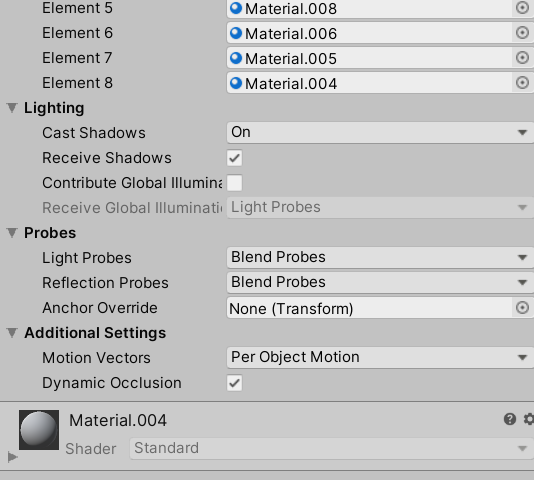
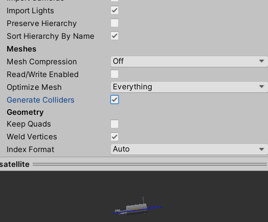
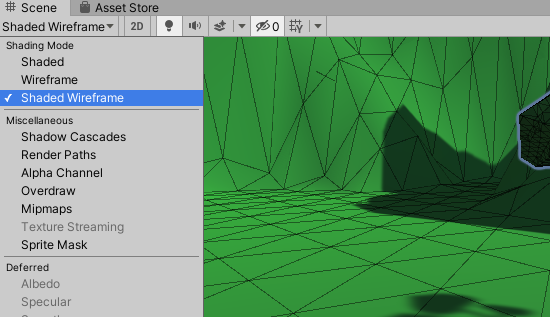
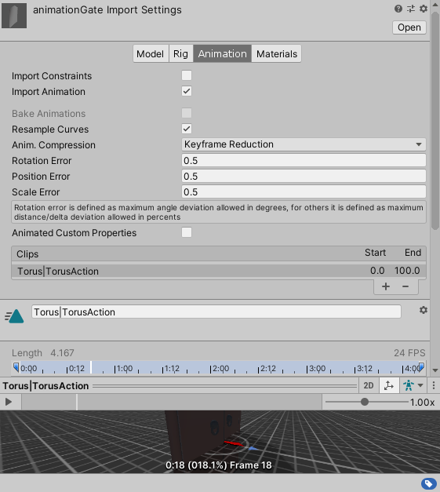
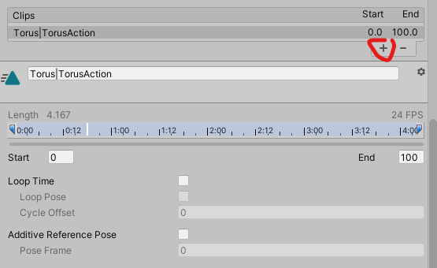
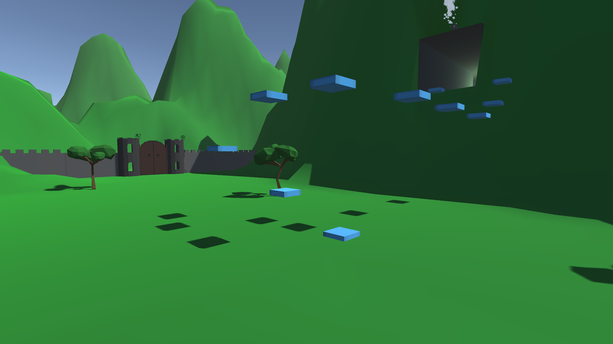
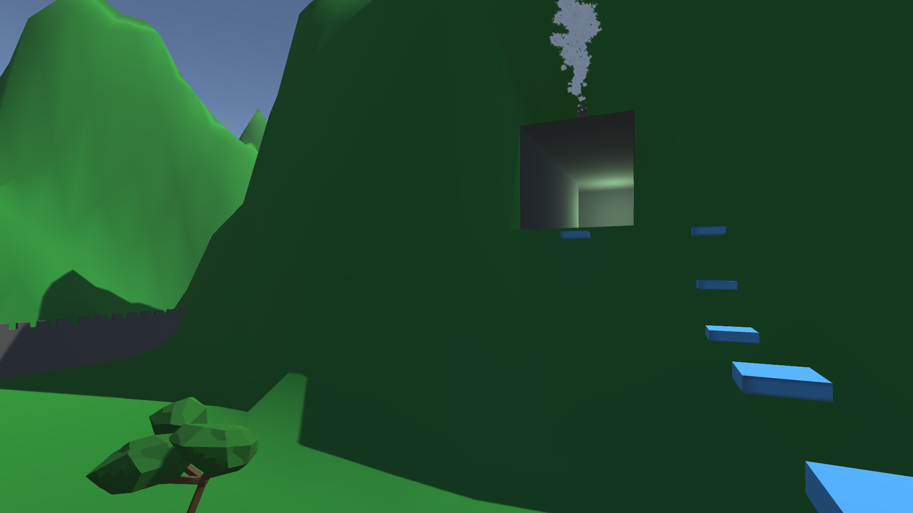
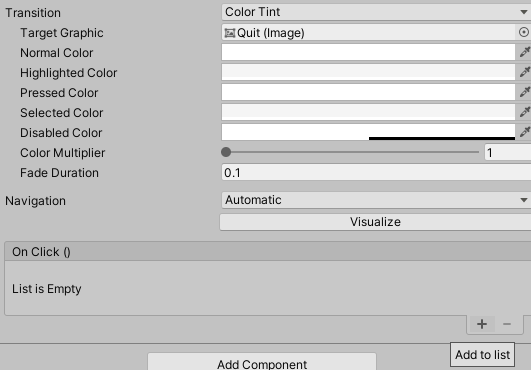

# 3D Unity User Guide

## About

This it a 3D Unity user guide that acts as a tutorial in making a 3D platformer. I will go through 3D games design along with general tips and tricks for solo and team-based projects. Without further ado, let's begin! 

<a name="top"></a>

## Index

1. [Installation](#install)
2. [General](#main)
3. [Unity Editor Overview](#unity)

#### [3D](#3D)

4. [General](#5a)
5. [3D Models & Bodies](#5b)
   * [Resources](#m_res)
   * [Software](#software)
   * [Libraries](#libraries)
   * [Unity](#m_unity)
6. [Movement](#5c)
7. [Camera](#5d)
8. [Lighting](#light)
9. [Prefabs](#5f)
10. [Particle Systems](#5g)
11. [Animation](#3anim)
12. [Collectibles](#3coll)
13. [Events](#3events)
14. [Music & Sounds](#3music)
15. [Odds and Ends](#3odds)
    * [Pausing](#3_pausing)
    * [Quiting](#3_exit)
16. [Demo](#3demo)
17. [Title Screen](#3_title)
18. [Scripting](#script)
19. [Building](#build)
20. [Cloning Guide](#guide)
21. [Collaboration](#team)
    * [Unity's Collab](#unity) (recommended)
    * [GitHub](#git)
22. [Resources](#help)

<a name="install"></a>

### 1. Installation

Before installing, note that Unity is **completely free**, if you or your company makes less than $100 000 (USD). 

Follow the link [here](https://store.unity.com/download) and download the free installer (the plus version is definitely not necessary). Follow the instructions and download the installer. The Unity installer is simple and easy to use nevertheless, this [video](https://www.youtube.com/watch?v=KMuMhA6Lk0I) for Windows is a tutorial in installing it. Also note that you will may need a Unity account or just use your Google/Facebook account to sign in. 

If you want a new version of Unity, go to the Unity Hub and click the **Installs** tab on the left and **ADD** (top right) the desired version (it is recommended that you pick a version with **long term support** or LTS); however do be warned that this tutorial was made in **2019.3** so in newer versions, things might have moved places or removed entirely 😞. Afterwards, the installation will take quite a while, even with a fast internet connection. 

When installing Unity, it might ask you to install **Visual Studio** along-side Unity. If you have Visual Studio, do not install again, it should automatically detect the current VS on the system. Otherwise, it is optional and MonoDevelop (comes with Unity) is good enough for handling coding in Unity. 


<a name="main"></a>

### 2. General

**Unity** is a 3D game engine built in **C#** but can be used for 2D. Before you freak out about programming, let me assure, you it is quite trivial. If you have programmed before especially in C++, it is a huge plus. If you have not, don't worry, it's just a bunch of copy and pasting. The most important thing is don't be frustrated and 

```c#
Debug.Log() // logs to Unity console
```

is your friend. 

Being organized in Unity is a must, especially for big projects. Have organized folder will help a ton, in addition, using empties as folders within scene is *+1 organization*. 


<a name="unity"></a>

### 3. Unity Editor Overview

Unity is a panel based application. These panels can be rearranged however you like and saved as default. 


This is my default setup. The **Scene** panel is the most important viewport. This is where you modify the scene. The **Game** scene only turns on if you hit play. It is a preview of what the user will see if you build the current scene.

On the right hand side, we have the **Project** directory (folder) panel on the bottom. This is where all your assets are (ie art, music, scripts). The **Hierarchy** is like a layers panel in Photoshop. It is an arrangement of all elements in the scene. For every element of the scene can be hidden from the view by hitting eye button when hovering on the element. The lock button is the pointer icon. The **Inspector** contains all modifiable aspect of an element along with info. This is where you drag scripts in the element.

Other panels include a console, which will output when the game is run. The **Animator** and **Animation** go hand in hand and creates animation for sprites. 


## 3D

<a name="5a"></a>

### 	4 General

Good for you for deciding to go 3D. Before we go any further, it is not recommended that you start off with a 3D project if you are just starting out doing game design. Furthermore, it is recommended that you start with the previous 2D tutorial because some of the concepts and components will be similar or exact. 

To start a 3D project, press **New** and select 3D on the pop-up screen and use the desired directory (or follow my cloning [guide](#guide) so to not start from starch). This may take some time, but after Unity finishes installing itself, we can get started. Now let's make a 3D game!

When you start off, you will be brought up to a scene consisting of a directional light (which is like a ray/sun light) and a Camera

\* Note this tutorial (3D) follows this repo: https://github.com/Zeyu-Li/Unity-Tutorial-3D


<a name="5b"></a>

### 	5 3D Models & Bodies

<a name="m_res"></a>

#### Resources

Before we get to 3D bodies in Unity, it is necessary to get 3D models. Unity is not build to be a 3D modeling software, so 3D objects should be created in 3D programs or imported from 3D libraries. Therefore, I will recommend some free software and libraries

<a name="software"></a>

#### Software

**Free**

* [Blender](https://www.blender.org/) - a very powerful open source 3D modeling, texturing, animations, and general 3D software. All my models in the exercises where made in Blender. A good place to start is with [Andrew's Donut](https://www.youtube.com/watch?v=TPrnSACiTJ4&list=PLxLGgWrla12dEW5mjO09kR2_TzPqDTXdw). New 2.8 version is very similar to all other 3D software. I **very strongly** advice you use Blender because it is free and is often much better than paid software
* [TreeIt](https://www.evolved-software.com/treeit/treeit) - a tree generator with presets that range from cacti to palm trees

**Paid**

* [Cinema 4D](https://www.maxon.net/en-us/products/cinema-4d/overview/) - 59.99USD/month (overpriced and not as good as Blender)
* [Autodesk Maya](https://www.autodesk.com/products/maya/overview) - 1 620 USD/year (supposedly the industry standard) 
  \* Note I don't know if they have a 3 year free for students like other Autodesk CAD software

* [Houdini](https://www.sidefx.com/products/houdini/) - 199 USD / year
* [Substance Designer](https://www.substance3d.com/products/substance-designer) - $19.90/month (for **revenue** under \$100k) a node based texture designer

  \* Note this is a really powerful piece of software, but from my experience, it is not easy to learn and textures can be found online or created with other programs like Adobe Illustrator and converted into normal maps in Blender.

\* Note don't use CAD software like Fusion 360, Revit, Solidworks etc, because those are for CAD (computer assisted design) and are aimed towards engineers. Also, Blender has Architectural Plugin with many of the functionality of Autodesk Revit. 

<a name="libraries"></a>

#### Libraries

* [Unity Asset Store](https://assetstore.unity.com/3d) - free and paid assets
* [Free 3D](https://free3d.com/3d-models/unity) - be careful, some items are not for commercial applications

**Textures**

* [3D Textures](https://3dtextures.me/)
* [TTextureHaven](https://texturehaven.com/)
* [CC0 Textures](https://cc0textures.com/)

<a name="m_unity"></a>

#### Unity

If you have experience with 3D software like Cinema 4D, Blender, or the Autodesk suit, Unity 3D will be very familiar to you. If you have not worked in a 3D environment, there is some adjusting. Note I will **not** go through the tools (ie rotate, scale, transform) for manipulating 3D bodies because they are the universal shortcuts and effects (ie. `w` for move, `e` for rotate, and `r` for scale). 

First off note that you do not need to make all 3D asset body. There are many asset stores with free and paid models. Usually I will use tons of free assets from the asset package (or go to [asset store](https://assetstore.unity.com/3d)) and if I need something custom, I model it with Blender. I recommend learning a 3D software before going into Unity 3D because it can be translated almost directly to Unity with light sources, objects, texture maps, etc. (my recommendation is to follow [Blender Guru](https://www.youtube.com/user/AndrewPPrice) on YouTube). 

To import 3D models/bodies, you will have to import it as a fbx file (make sure you export only the things you have selected (the model) and not everything including the camera, lights, etc. or you can choose to not import the camera or lights in Unity) 

From there I have a model that can be dragged into the scene. Now you have the model with the materials and other properties included.



Of course, you can move it, rotate it, or scale it, but I will assume you know what to do that. However, if you want Unity to automatically general colliders for the model (generally good enough), 

1. Click on the model and under **Meshes** select **Generate Colliders**


\* Note for some things like platforms, **Generate Colliders** can be bad as the optimized mesh collides with the player, therefore switch to box colliders

2. Click **apply**
3. Now Unity is generating colliders and this may take a while

If you want a object to be solid and non-movable (this will use bake lighting, which I will go in more detail later), check **Static**. Remember, this will generate a bake map, which is CPU intensive and may take a lot of time depending on the size of the model. Unfortunately, if the object is really big, checking Static may actually slow things down, so keep that in mind

**Clean Snapping**

In many 3D programs, you will get options to snap to another object or vertex. This can be done in Unity. To achieve this,

1. Select **Shaded Wireframe** as the view

   
2. Click on the **Move Tool** (the one with the arrows in 4 directions), hold down the **v key** and it will snap to a vertex 
3. With the v-key still help, drag and it will snap to another vertex 

\* note if you want to organize the 'layers', use **Quads** as they are 3D equivalents of empties

Resource: https://youtu.be/NjflKgMepQs


<a name="5c"></a>

### 	6 Movement

**Legacy Way:**

~~For movement, generally, Unity's Standard Package can be used so no bones, animations, or controls need to be wired. I recommend importing Unity's character package. This is done by,~~

1. ~~installing the [Unity Standard Assets Package](https://assetstore.unity.com/packages/essentials/asset-packs/standard-assets-for-unity-2017-3-32351) in the **Asset Store**~~
2. ~~In a new player folder, go to Assets -> Import Package -> Characters and click **Import** (this may or may not work and thus, you may need to import all of the standard package and purge unused)~~
3. ~~In the imported Standard Assets, go to Characters -> FirstPersonCharacter->Prefabs->FPSController and drag it into the scene~~

**New way:**

Now that no Standard Packages exist, the easiest way to make a player is to create it from scratch

1. New empty object named player
2. add a **character controller** as a component to the empty
   1. You can change the slope limit (limit angle at which you traverse a slope)
   2. Skin width
   3. Center at which the character is based on 
   4. Radius and Height of the capsule containing the player
3. Add a camera to the empty, otherwise, move the empty exactly to the existing camera and move it such that it does not overlap meshes
4. At this point, you can add the mesh that is your player and have it hold up to some animations or preloaded with animations, but for this tutorial, I will use a yellow capsule
5. Next we want to control the camera with the mouse so create a cameraControl script in the scripts folder
6. Paste the following in
   ```c#
   using System.Collections;
   using System.Collections.Generic;
   using UnityEngine;
   
   public class cameraControl : MonoBehaviour
   {
       // sensitivety of mouse
       public float mouseSpeed = 100f;
   
       // place camera here
       public Transform player;
   
       float xRotation = 0f;
   
       // Start is called before the first frame update
       void Start() {
           Cursor.lockState = CursorLockMode.Locked;
       }
   
       // Update is called once per frame
       void Update()
       {
           float mouseX = Input.GetAxis("Mouse X") * mouseSpeed * Time.deltaTime;
           float mouseY = Input.GetAxis("Mouse Y") * mouseSpeed * Time.deltaTime;
   
           // for every frame, move camera up or down
           xRotation -= mouseY;
           // clamp the up down rotation
           xRotation = Mathf.Clamp(xRotation, -85f, 85f);
   
           transform.localRotation = Quaternion.Euler(xRotation, 0f, 0f);
           player.Rotate(Vector3.up * mouseX);
       }
   }
   ```
7. Optionally, you can smooth out the camera using the Lerp method
8. Drag the player empty object into the Transform
9. Next is movement
10. Add a new player movement script to the empty player object
11. Paste the following
    ```c#
    using System.Collections;
    using System.Collections.Generic;
    using UnityEngine;
    
    public class movement : MonoBehaviour
    {
        public CharacterController controller;
    
        public float movementSpeed = 14f;
    
        // gravity
        public float gravity = -10f;
        Vector3 velocity;
    
        // ground check
        public Transform groundCheck;
        public float checkRadius = 0.1f;
        public LayerMask ground;
    
        public bool isGrounded = false;
    
        // jump
        public float jump = 1f;
    
        // slope
        public bool isSliding = false;
        public float slopeLimit = 35f;
        private Vector3 slopeParallel;
    
        // Update is called once per frame
        void Update()
        {
            // is grounded calculations
            isGrounded = Physics.CheckSphere(groundCheck.position, checkRadius, ground);
    
            if (isGrounded) {
                velocity.y = -2f;
            }
    
            float x = Input.GetAxis("Horizontal");
            float z = Input.GetAxis("Vertical");
    
            Vector3 move = transform.right * x + transform.forward * z;
    
            controller.Move(move*movementSpeed*Time.deltaTime);
    
            // slopes, modified from https://answers.unity.com/questions/1502223/sliding-down-a-slope-with-a-character-controller.html
            if (isGrounded) {
                RaycastHit hit;
                Physics.Raycast(transform.position, Vector3.down, out hit);
                // Saving the normal
                Vector3 n = hit.normal;
    
                // Crossing my normal with the player's up vector (if your player rotates I guess you can just use Vector3.up to create a vector parallel to the ground
                Vector3 groundParallel = Vector3.Cross(transform.up, n);
    
                // Crossing the vector we made before with the initial normal gives us a vector that is parallel to the slope and always pointing down
                slopeParallel = Vector3.Cross(groundParallel, n);
                Debug.DrawRay(hit.point, slopeParallel * 10, Color.green);
    
                // Just the current angle we're standing on
                float currentSlope = Mathf.Round(Vector3.Angle(hit.normal, transform.up));
    
                // If the slope is on a slope too steep and the player is Grounded the player is pushed down the slope.
                if (currentSlope >= slopeLimit) {
                    isSliding = true;
                }
                // If the player is standing on a slope that isn't too steep, is grounded, as is not sliding anymore we start a function to count time
                else if (currentSlope < slopeLimit && isSliding) {
                    isSliding = false;
                }
            }
    
            if (isSliding) {
                controller.Move(slopeParallel.normalized / 2 * Time.deltaTime);
            }
    
            // jump
            if (Input.GetButtonDown("Jump") && isGrounded) {
                velocity.y = Mathf.Sqrt(jump * -2f * gravity);
                if (isSliding) {
                    // cut jump in halve
                    velocity.y /= 2;
                }
            }
    
            velocity.y += gravity*Time.deltaTime;
    
            controller.Move(velocity * Time.deltaTime);
        }
    }
    ```

    This accounts for gravity and movement
    
    \* Note you can change the speed of movement, gravity constant, jump check radius, under the script. Also, sliding down slopes is a given
    
12. For the gravity to work properly, a ground check must be preformed to reset the velocity. To do this, create empty object in player and place at the feet of the player
13. Add new layer of ground to preform jumps and gravity checks on and apply it to the models

Resource: [Brackeys](https://www.youtube.com/watch?v=_QajrabyTJc)


<a name="5d"></a>

### 	7 Camera

There are a few options for cameras. For a fixed camera following the player:

1. Nest the camera into the Player
2. Move to the right position and angle


There are special camera options (such as a more flexible or switching to several fixed cameras) that use Cinemachine. Tutorials for Cinemachine can be found below:

[Brackeys](https://www.youtube.com/watch?v=Gx9gZ9cfrys)

[FilmStorm](https://www.youtube.com/watch?v=J1GgvDfmIo0)


<a name="light"></a>

### 	8 Lighting

Just like other 3D applications, Unity has an array of lighting options

The most important of these are the following:

1. Point light - light is emitted from a point
2. Directional light - a moon or sun light. Position does not matter, but the rotation determines the angle of attack
3. Spot light - like that of a lamp
4. Light Area - light emitted from an area

From there, we can change some properties of the lights:

* range - range of light source
* color - color of light
* shadow type
  * soft shadows - blurred shadow
  * hard shadows - very rough edged shadows

Some other light options include an ambient light that lunates everything. This can be changed this in the Window -> Rendering -> Lighting Settings. From there, there are many options can you can play with. Also in the options is to add atmospheric fog.

Another important things about lighting is bake lighting. Baking is a way to save space by "baking" or pre-mapping the lighting in the texture map so lighting does not need to be calculated again in real time. This may be something you would want to look into if you have problems with framerate, or just want to speed/smooth out the game. 


<a name="5f"></a>

### 	9 Prefab

A prefab is simply a clone that can be dragged to the scene

This means that things in other scenes can be reused

To make a prefab, just drag the desired prefab object from scene to the prefabs folder


<a name="5g"></a>

### 	10 Particle Systems

3D particle systems are very similar to 2D particle systems, therefore so particle options, go to the 2D [particle section](https://github.com/Zeyu-Li/unity-user-guide#4f-particle-system) for help with the options

For this tutorial, I will just be adding a smoke particle effect from a pipe

1. Import the pipe. I have one provided in the models folder if you want to follow along. (Again, this model was made by myself and you can use it in your projects) 
2. In the new model, add a new **particle system** be right clicking -> Effects -> Particle System
3. Move, rotate and scale it to the right size (note the scale should be equal in all directions (x,y,z) for it to remain uniform)
4. Changing the shape will determine the emission's direction
5. Changing other attributes with the link above to the desired particle
6. To change the texture of the particles, just drag and drop the image onto the particles


<a name="3anim"></a>

### 	11 Animation

Unity animations are very similar to other 3D animating software. This means there is a timeline with keyframes. For this tutorial, I will be doing a spinning and blobbing key. 

1. Place the object in the scene
2. Go to the animation window and click **Add Animation**
3. Save to the animation folder and set the time to whatever
4. From there, you can click **Add Property **add something you would like to change over time
5. For my example, I chose to key frame the rotation and position
6. Set the start value and click the **Add Keyframe** (which looks like a diamond).
7. Go to the end position and change the keyframe value (once changed the text area should be red) and click **Add Keyframe**
8. Note the curves are set to non-linear (ie ease in and ease out). Therefore, to make them linear, I found the easiest way to do that would be to go the the **Curves **tab, click on the keyframe and a handle will appear. Drag the handle to the first keyframe or vice versa.

\* If you want to move this in global space, encapsulate it in a empty object and move the empty

Another way to the the animation is to do it in the 3D program of choice (for me Blender) and export the animation within the fbx file format

1. Have the export fbx with animation made
2. Click on the fbx in Unity and change it to **Animation**

   
3. If you have several animations, you have to separate the different animations apart by clicking the add icon (below) and adjusting the start and end frames

   
4. Create an animations controller and rename it. Also double click it
5. It will open up the Animator window so right click and click Create State -> Empty
6. Open the new empty state and rename it. Afterwards, change the motion to the imported motion (ie, it would be Torus|TorusAcion for my animation (seen above))
7. Add an **Animator **to the animated object in scene and add the controller. If you enable the animator the animation plays. With this in mind, I will use an event to enable the animation [later](#3events)

   

<a name="3coll"></a>

### 	12 Collectables

1. The collectable should have the desired tag before starting
2. Within the player controller (movement.cs) check for collision with the tag. If overlap, destroy the object
   ```c#
   private void OnTriggerEnter(Collider collision) {
       if (collision.gameObject.CompareTag("key")) {
           Destroy(collision.gameObject);
       }
   }
   ```
3. Now once the player collides with the key, the key is destroyed

Next thing we might want to do is add the key to our inventory. 

1. Create a UI -> Canvas count object to be displayed once the object is collected
   For my project, it is simply a sprite of a key appearing as I collect it
2. The player should have the player tag
3. Create a new script for the key once it is collected by the player
4. I named my script key and had this in my script:
   ```c#
   using System.Collections;
   using System.Collections.Generic;
   using UnityEngine;
   
   public class key : MonoBehaviour
   {
    public GameObject menu;
       private bool isShowing = false;
   
   
       // Start is called before the first frame update
       private void OnTriggerEnter(Collider collision) {
           if (collision.gameObject.CompareTag("Player")) {
               isShowing = true;
               menu.SetActive(isShowing);
           }
       }
   }
   
   ```

Now if the key is collected, the key will show up on screen


<a name="3events"></a>

### 	13 Events

For this tutorial, I will make an event that activates once the key is collected. After which, a door opens. 

\* Note this is working from the last collectables and animation section

1. Within the key script, replace with the following:

   ```c#
   using System.Collections;
   using System.Collections.Generic;
   using UnityEngine;
   
   public class key : MonoBehaviour
   {
       public GameObject menu;
       private bool isShowing = false;
   
       // gate animation
       public GameObject gate;
       Animator gateAnim;
       public GameObject goal;
   
       private void Start() {
   
           gateAnim = gate.GetComponent<Animator>();
   
       }
   
       // Start is called before the first frame update
       private void OnTriggerEnter(Collider collision) {
           if (collision.gameObject.CompareTag("Player")) {
               isShowing = true;
               menu.SetActive(isShowing);
               gateAnim.enabled = isShowing;
               goal.enabled = isShowing;
           }
       }
   }
   ```
2. Drag the gate containing the animator into the gate box and a goal with a collider to send you to the end screen to the goal box
3. Now when the player collects the key, the gate will open and a goal with appear to the player to get to

Now the final set is to send the player into the end screen after colliding with the goal box

1. Set up the goal box
2. Set up a new scene with the endscreen (this will simply be a black screen saying to be continued)
3. Make a new script in the goal object
4. In the script simply type out the following

   ```c#
   using System.Collections;
   using System.Collections.Generic;
   using UnityEngine;
   using UnityEngine.SceneManagement;
   
   public class endScene : MonoBehaviour {
       static public bool end = true;
       private void OnTriggerEnter(Collider collision) {
           if (collision.gameObject.CompareTag("Player")) {
               Done();
           }
       }
   
       // Update is called once per frame
       void Done() {
           SceneManager.LoadScene("title");
       }
   }
   ```

   

<a name="3music"></a>

### 14 Music & Sounds

Music and sounds are important in the gameplay as it immerses the player into the game. This section will be split into two parts, music and sounds. 

**Music**

Adding a track to the game is as easy as counting to 3. 

1. Have a music track (you can use mine called happy if you so choice)
2. Simply drag the music into the player object
3. In the settings you can change if it plays on startup and if it loops

\* Note when you are playing the game, don't forget to hit unmute

**Sounds**

Ambient sounds can be a great way to add that something extra to the game. This can be rustling leaves or  footsteps. For this tutorial, I will do footstep sounds when the player walks.

1. Have a sound to play (an excellent resource is https://freesound.org/)
2. In the movement script add the following:
   ```c#
   public class movement : MonoBehaviour
   {
   
       // sound
       public AudioClip[] footsteps;
       public float volume = .5f;
       public AudioSource listener;
       private int index;
       private float counter = 0;
   
       private void Start() {
           listener = GetComponent<AudioSource>();
       }
   
       // Update is called once per frame
       void Update()
       {
           // is grounded calculations
           isGrounded = Physics.CheckSphere(groundCheck.position, checkRadius, ground);
   
           float x = Input.GetAxis("Horizontal");
           float z = Input.GetAxis("Vertical");
   
           if (isGrounded) {
               velocity.y = -2f;
               // plays walk sound
               if (counter <= 0 && (x != 0f || z != 0f)) {
                   index = Random.Range(0, footsteps.Length);
                   counter = footsteps[index].length;
                   listener.PlayOneShot(footsteps[index], volume);
               }
               counter -= Time.deltaTime;
           }
   
           Vector3 move = transform.right * x + transform.forward * z;
   	}
   }
   ```
3. Grab the footsteps and place it in the footsteps audioclips after putting the number of audio clips to randomly chose from
4. Add the audio listener and change volume


<a name="3odds"></a>

### 15 Odds and Ends

<a name="3_pausing"></a>

#### Pausing

Pausing with Unity can be made simple with one command. 

1. Create script pause and drag it on your player (optionally, you can just do this in the movement folder, but this will be more organized)
2. Create a pause UI element (I will be doing a simple Pause text)
3. Paste in the following:
   ```c#
   using System.Collections;
   using System.Collections.Generic;
   using UnityEngine;
   
   public class pause : MonoBehaviour
   {
       public static bool paused = false;
   
       public GameObject pauseMenu;
   
       // Update is called once per frame
       void Update()
       {
           if (Input.GetKeyDown(KeyCode.P)) {
               Pause();
           }
       }
   
       void Pause() {
           if (!paused) {
               pauseMenu.SetActive(true);
               Time.timeScale = 0f;
           } else {
               pauseMenu.SetActive(false);
               Time.timeScale = 1f;
           }
           paused = !paused;
       }
   }
   ```
4. Place the UI element in the Pause menu box

Resource: https://www.youtube.com/watch?v=JivuXdrIHK0


<a name="3_exit"></a>

#### Exit Game

To quit game simply add the following onto the player:

```c#
if (Input.GetKey("escape")) // change escape to any other character if you like 
{
    Application.Quit();
}
```

in the update method

\* Note, of course more logic could be added to make this more complicated


<a name="3demo"></a>

### 16 Demo

I hope you enjoyed this tutorial and the finished version is here.

Unfortunately, I cannot insert a demo here as it would be too long, but I can share some screenshots here:






Feel free to play the game or use any of the resources for the game. I hope you've enjoyed this experience and I wish you luck in making your games. 

[🔝 Back to Top](#top)


<a name="3_title"></a>

### 17 Title Screen

One of the last things to do is to create a title screen. I will be basing my title screen on the 3D game.

1. For my scene, it is the camera spinning through the 3D scene
2. Overlaid is a canvas with a black panel within it
3. Now you can populate with text, sprites, buttons and so forth, adjusting them to your liking
4. To add functionality to the button, attach a script to the collection of menu object
5. Populate with functions of the button in their own separate methods. For example, my script looks like the following:
   ```c#
   using System.Collections;
   using System.Collections.Generic;
   using UnityEngine;
   using UnityEngine.SceneManagement;
   
   public class menu : MonoBehaviour
   {
       // Start is called before the first frame update
       public void play() {
           SceneManager.LoadScene("main");
       }
   
       public void quit() {
           Application.Quit();
       }
   
   }
   ```
6. With the button selected, click on the **+** icon in the On Click part (below)

   
7. Drag the menu in the None (Object) box
8. In the drop down (no function), change into the function you want to activate (it will be in the name of the script)


<a name="script"></a>

### 18 Scripting

Unity is based on C# and is very much a c-styled programming language. That means it resembles programs that are written in C, C++, or Java. 

The main thing to know though is Unity's implementation of C#

If you create a script, automatically, it will be drawn from a template that looks similar to the following:

  ```c#
  using System.Collections;
  using System.Collections.Generic;
  using UnityEngine;
  
  public class movement : MonoBehaviour
  {
      // Start is called before the first frame update
      void Start()
      {
          
      }
  
      // Update is called once per frame
      void Update()
      {
          
      }
  }
  ```

You will notice that at the top there are imports from Unity's other libraries using the **using** keyword. Afterwards, Unity defines the script as a class*. The class is defined as public so other scripts and Unity can assess and utilize this class. The name you gave the script will follow the **class** keyword. Afterwards, **MonoBehaviour** is defined as what movement inherits from. Think of this as your script **extending** from class MonoBehaviour. 

\* Note a class is a data structure that holds a collection of information on the class (ie. its attributes and methods). 

Below that and indented, we see void Start() and void Update(). As the comments suggest, void Start() occurs before the first frame update and void Update() is called once per frame. Note **void** means there will not be a return value (ie. no return statement).

Also, there are different methods of MonoBehaviour such as **FixedUpdate()** that may update more or less than once per frame. This will be important for any physics related functions

A list of other functions and methods that can be used can be found on the [Unity Documentation](https://docs.unity3d.com/ScriptReference/MonoBehaviour.html) site, however, the most important thing about learning and debugging Unity is to use

  ```c#
  Debug.Log() // logs to Unity console
  ```

When using this, after running the game, it will output to Unity's debug console


<a name="build"></a>

### 19 Build

So you are finished your game. You need to disturbed the game. This is done through building the game. 

1. Go to **File**, **Build Settings...**
2. Select the scenes that you want to build

   
3. Select the desired **Platform**
4. You can customize the company name, product name, icon, and cursor
5. **Build** (**And Run** if you want to run it)
6. Select the folder and wait for it to build


\* Note if you did not add an exit game button, the only way to exit is to close the program externally or Alt-f4


<a name="guide"></a>

### 20 Cloning Guide

To download the finished project:

  1. Go to https://github.com/Zeyu-Li/Unity-Tutorial-2D
  2. Download ZIP after clicking Clone or download

     
  3. Unzip and move to desired directory
  4. Go on Unity Hub and click **Add** and located to directory
  5. The project should appear in Projects and it is done
  6. Click on the project to open it

  \* Note if you want the project at different steps click on commits or https://github.com/Zeyu-Li/Unity-Tutorial-3D/commits/master and between April 13, 2020 `added imaged` commit to May 6, 2020 `finished game` is when various steps where completed. To download the project file at these times, click on the bracket thing (see below) and repeat above from step 2


<a name="team"></a>

### 21 Collaboration

<a name="unity"></a>

#### Unity's Collab

Collaborating will friends can be tough will Unity, especially with git/GitHub, but it you are careful, things could turn out fine.

If you need to collaborate, the best way is to use Unity's Collab feature


However, note that this only supports 4 people (which is usually enough because only people that will contribute to the codebase should need it)


<a name='git'></a>

#### GitHub

Otherwise if you decide to GitHub, here are some general practices:

1. Everyone should work on there own branches and work on there own scenes working towards **Prefabs** (ie one person on movement, one on moving platforms, etc.)
2. Optionally, have one person on the master (final) level to peace it together
3. Use [this](https://github.com/github/gitignore/blob/master/Unity.gitignore) gitignore or clone from my projects on GitHub
4. Have the core gameplay done first (especially at a Game Jam)
5. Get to know Git/GitHub and how version control works
6. Remember you can go back to a previous working version
7. Have fun and don't fight with your team members

[🔝 Back to Top](#top)


<a name="Help"></a>

### 22 Resources

* The [Unity User Manual](https://docs.unity3d.com/Manualindex.html) provides some great documentation with code that can for the most part be copied and pasted
* Brackeys [YouTube channel](https://www.youtube.com/user/Brackeys)
* [Lynda.com](https://www.lynda.com/) - If you have a library card, there is a high probability that you have access to Lynda with their organization deal
* Google is your best friend
* Ask on Reddit or Stack Exchange, don't worry they won't bite

